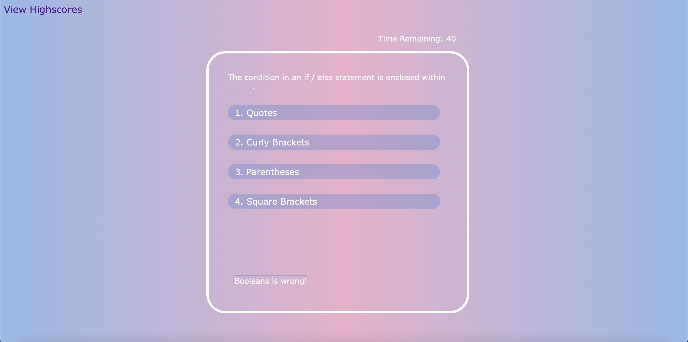

# Code-Quiz

## Description

This is a timed multiple-choice quiz application that tests the user's knowledge on Javascript fundamentals. The application locally stores the highscores for the user to keep track of their most recent progress. Code Quiz uses HTML, CSS, and Javascript to create a responsive user interface for multiple display sizes. 

## Link

https://thangnt336.github.io/Code-Quiz/

## Usage

